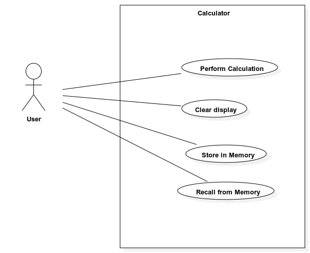
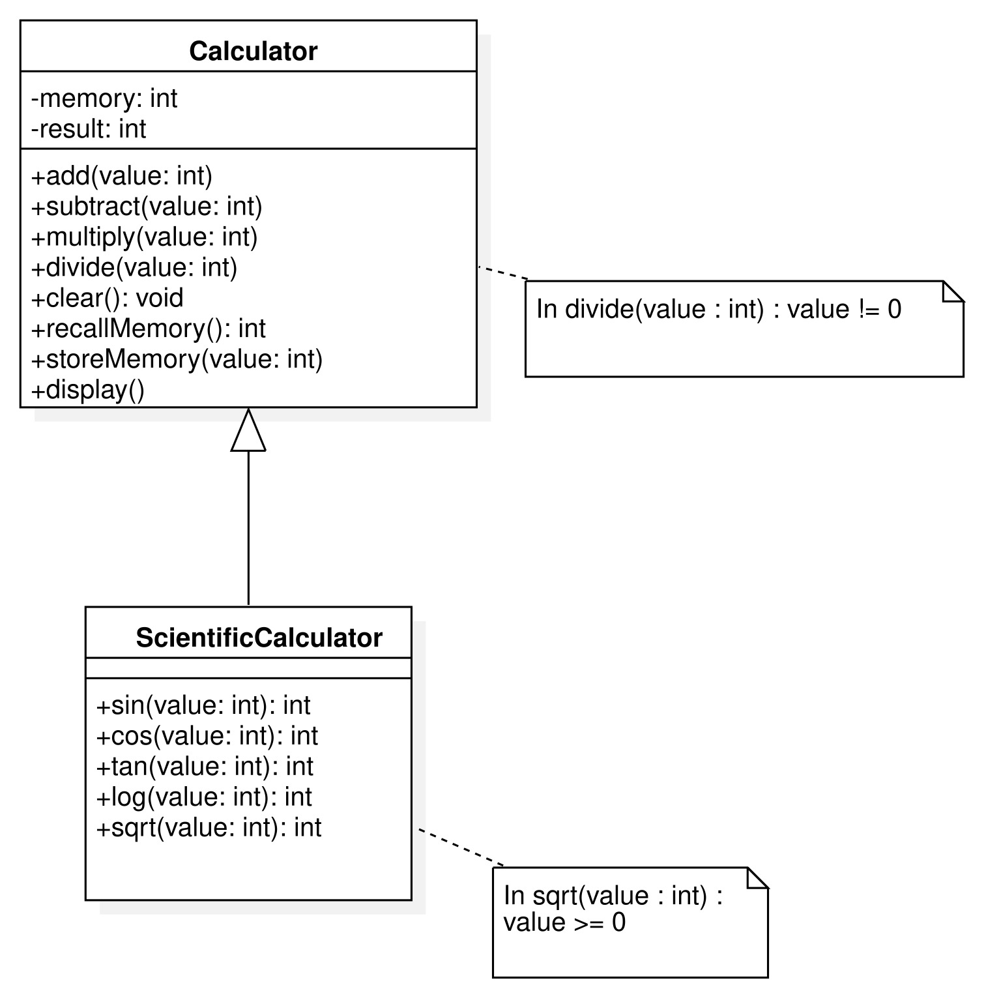
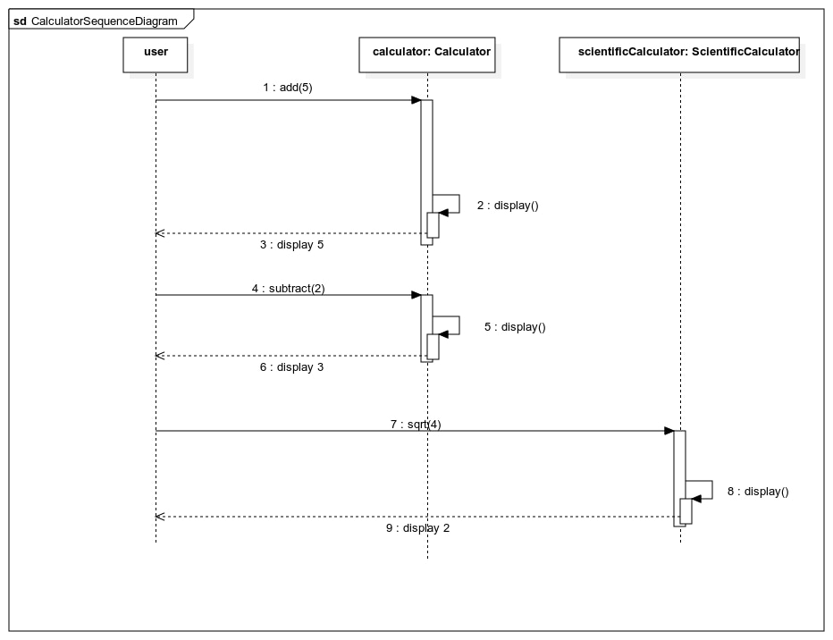

# Project Documentation

## Table of Contents

1. [CIM : Use Case Diagram](#use-case-diagram)
2. [PIM](#pim-images)
3. [Class Diagram](#class-diagram)
4. [PSM Images](#psm-images)
5. [Authors](#authors)

## CIM as Usecase Diagram

## PIM
### Class Diagram

The class diagram is derived from CIM.

### Sequence Diagram
The sequence diagram is derived from CIM.

## PSM
From the PIM, we obtain two PSMs, one in Java and the other in Python.

### Java PSM
[Link to Java PSM](./PSM_Java)

### Python PSM
[Link to Python PSM](./PSM_python)

## Authors 

- Lucas Lecoin
- Chloé L'Hermite
- Tali Hassoun
- Théo Moussaoui
- Maxime Pierront
- Ryan Vernex